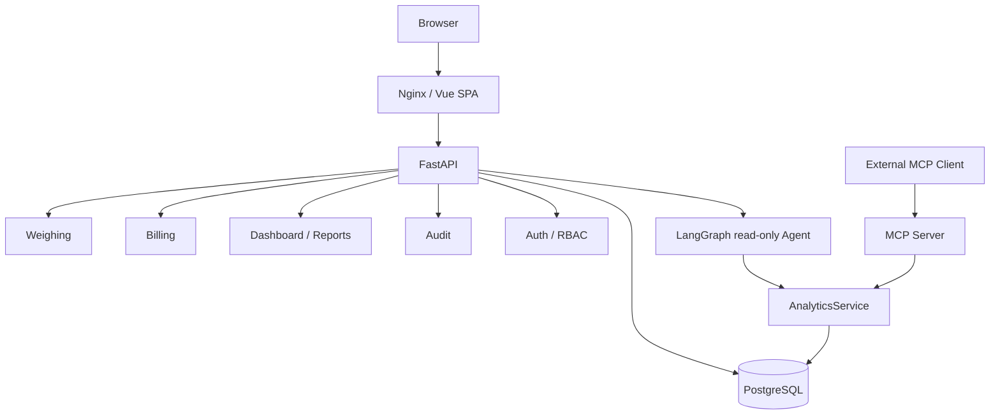

# TimberOps

TimberOps 是面向中小型货运与加工场景的车辆称重和经营管理系统。当前支持木材、煤炭、矿石及其他货物，提供从车辆与客户建档、人工称重、超重复磅到计费、审计、报表的完整闭环。

当前仓库处于 **Phase 2.7.5 / 开发版本 0.7.0**。它是可运行的工程项目，但不宣称已经完成生产部署或达到 v1.0 发布条件。

## 已实现能力

- 车辆、客户管理及历史数据保护
- 人工皮重、毛重、超重复磅、任务完成和称重历史
- Excel 称重历史及日/月经营报表导出
- 完成称重后按车辆类型自动生成费用，支持支付与免除
- 真实数据 Dashboard、费用中心、审计日志和经营报表
- JWT 登录、公开注册开关、待授权账号体验、ADMIN / OPERATOR / VIEWER RBAC
- Bootstrap Admin 安全初始化与最后一个管理员保护
- 只读 LangGraph AI Agent 和豆包 Provider（可选）
- 面向外部 Agent 的 Streamable HTTP MCP Server（只读）
- 开发与生产 Docker Compose、Nginx 前端入口、PostgreSQL 持久化
- 结构化请求日志、Prometheus-compatible Metrics、`/health` 与 `/ready`

## 系统架构



内部 LangGraph Agent 与外部 MCP Server 是两条独立入口；两者复用只读 `AnalyticsService`，AI 不可用不会阻塞核心称重业务。

## 核心业务流程

正式任务状态为：

`WAIT_TARE → TARE_COMPLETED → WAIT_GROSS → GROSS_COMPLETED → COMPLETED`

`status` 表示任务生命周期；`weight_result` 独立表示 `PENDING / NORMAL / OVERWEIGHT`。超重时任务回到 `WAIT_GROSS`，接受重新称重，直至结果正常后完成。重量统一使用吨和 `Decimal`。

## 技术栈

- 后端：Python 3.11+、FastAPI、SQLAlchemy 2、Pydantic 2、Alembic、PostgreSQL、pytest
- 前端：Vue 3、TypeScript、Vite、Element Plus、Pinia、Axios
- AI / 集成：LangGraph、豆包 Provider、MCP Python SDK
- 运行：Docker Compose、Nginx、Prometheus client

## 本地开发

```powershell
Copy-Item .env.example .env
# 修改 .env 中的数据库密码、DATABASE_URL 和 JWT_SECRET_KEY
docker compose up -d db

cd backend
python -m venv .venv
.venv\Scripts\Activate.ps1
pip install -r requirements.txt
python -m alembic upgrade head
python -m app.cli.bootstrap_admin
python -m uvicorn app.main:app --reload
```

另开终端启动前端：

```powershell
cd frontend
npm install
npm run dev
```

默认开发入口为 `http://localhost:5173`。API 文档仅在 `ENABLE_API_DOCS=true` 时开放。

## Production Compose 快速启动

```powershell
Copy-Item .env.example .env
# 至少修改 POSTGRES_PASSWORD、DATABASE_URL_DOCKER、JWT_SECRET_KEY、FRONTEND_PORT
# AI 配置可选；生产建议 PUBLIC_REGISTRATION_ENABLED=false
docker compose -f docker-compose.prod.yml config --quiet
docker compose -f docker-compose.prod.yml up -d --build
docker compose -f docker-compose.prod.yml ps
```

不要提交 `.env`。生产数据库地址必须使用 Compose 服务名 `db`，且 `DATABASE_URL_DOCKER` 中的密码要与 `POSTGRES_PASSWORD` 一致。

## 运维端点

| 端点 | 用途 |
| --- | --- |
| `GET /health` | 进程存活检查，不访问数据库 |
| `GET /ready` | PostgreSQL 就绪检查，采用短生命周期快速失败连接 |
| `GET /metrics` | Prometheus 文本格式；由 `ENABLE_METRICS` 控制 |
| `GET /docs` | Swagger UI；由 `ENABLE_API_DOCS` 控制 |

## 文档

- [系统架构](docs/architecture.md)
- [业务流程](docs/business-flow.md)
- [数据库设计](docs/database-design.md)
- [开发路线](docs/development-plan.md)
- [生产部署](docs/deployment.md)
- [安全基线](docs/security.md)
- [可观测性](docs/observability.md)
- [Metrics](docs/metrics.md)
- [后端说明](backend/README.md)
- [前端说明](frontend/README.md)

## 当前边界

当前没有订单、库存或物料主数据模块，也没有支付网关、真实磅秤适配器、任务冲正/作废流程、Refresh Token、SSO、多租户、RAG 或多 Agent 编排。MCP 默认仅绑定回环地址，远程暴露前必须补充认证与网络边界。

## Production / v1.0 Checklist

- [ ] 使用强 PostgreSQL 密码并完成发布前 Secret 扫描
- [ ] 为每个环境生成独立且足够长的 JWT Secret
- [ ] 明确并验证公开注册策略
- [ ] 在入口层配置 HTTPS / TLS
- [ ] 建立并演练数据库备份与恢复
- [ ] 远程暴露 MCP 时增加认证和访问控制
- [ ] 完成 CI 与工程检查
- [ ] 接入真实磅秤前完成设备协议与故障降级验证
