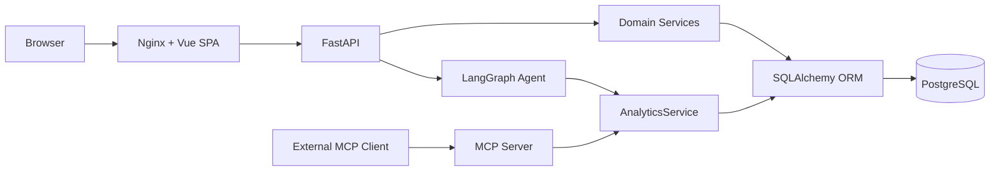

# TimberOps 系统架构

## 1. 架构选择

TimberOps 当前采用模块化单体：单个 FastAPI 应用承载 HTTP 业务模块，单个 Vue SPA 提供交互，PostgreSQL 保存业务数据。该结构便于中小型团队维护事务一致性，也为以后按清晰模块边界拆分保留空间。

内部 Agent 和外部 MCP Server 是独立入口。它们共享只读 AnalyticsService，不共享会话协议，也不直接写 SQL。AI 能力由配置开启；未配置、超时或失败时，车辆、称重、计费等核心模块仍独立工作。

## 2. 后端分层

| 层 | 职责 |
| --- | --- |
| API | 路由、请求校验、依赖注入、HTTP/业务错误映射 |
| Security | bcrypt、JWT、当前用户解析、permission enforcement |
| Service | 状态转换、事务边界、统计查询、审计协调 |
| Domain | 枚举、称重状态机、RBAC Catalog |
| Model / DB | SQLAlchemy ORM、Session、PostgreSQL、Alembic |
| Integrations | LangGraph / Doubao、MCP；均不得成为核心业务依赖 |
| Observability | 请求日志、Metrics、健康和就绪信号 |

API 不直接承载业务规则；Service 不依赖 Vue；数据库结构只通过新增 Alembic migration 演进。

## 3. 已实现业务模块

- Auth / RBAC：本地账号、JWT、角色、权限、Bootstrap Admin、注册开关
- Vehicle / Customer：主数据、软删除和历史引用保护
- Weighing：任务、不可变磅秤读数、显式状态转换、超重复磅
- Billing：车辆类型规则、完成时费用快照、支付与免除
- Dashboard / Reports / Export：UTC+8 统计、Decimal 金额/重量、Excel 导出
- Audit：敏感业务操作的追加式记录与只读查询
- AI / MCP：基于 AnalyticsService 的只读自然语言或协议化查询

当前没有 Order、Inventory、Material 模型或接口；这些概念不能作为现有系统能力描述。

## 4. 认证与授权

用户通过 bcrypt 校验密码并获得 HS256 Access Token。JWT 包含主体、用户名、签发/过期时间和 `jti`。FastAPI 依赖解析当前用户，`require_permission()` 执行后端授权。

标准角色为 ADMIN、OPERATOR、VIEWER。Vue 的菜单、路由和按钮控制只负责用户体验，不能替代后端权限检查。公开注册用户默认没有角色，通过待授权页面等待 ADMIN 分配。

## 5. 事务与数据一致性

- 称重读数以 `WeighingRecord` 追加保存，任务保存当前有效汇总。
- 状态机拒绝非法转换；`version` 用于称重任务并发控制。
- 完成称重和创建唯一 BillingRecord 位于同一业务事务。
- 支付、免除、删除、角色变更等敏感操作与 AuditLog 在相应事务内协调。
- 车辆、客户和允许删除的任务采用软删除；历史记录保持可追溯。

## 6. 部署拓扑

`docker-compose.prod.yml` 包含：

- `frontend`：Nginx 托管 Vue 并代理 API
- `backend`：FastAPI，多进程 Uvicorn 运行
- `db`：PostgreSQL 持久卷，不映射宿主机公网端口
- `mcp`：独立进程，默认绑定宿主回环地址

Backend 在启动时执行 Alembic upgrade；容器健康检查使用 `/ready`。实际公网入口仍需在部署环境增加 HTTPS/TLS。

## 7. 可观测性

- JSON 请求日志：request id、路径模板、状态码、耗时和可解析的 JWT 用户上下文
- Prometheus-compatible `/metrics`：HTTP、AI、称重、计费与数据库连接池指标
- `/health`：轻量 liveness，不访问数据库
- `/ready`：短生命周期、快速失败的数据库探测，不改变主业务 Engine 的连接策略

`request_id` 是日志关联标识，不是分布式 `trace_id`。当前未集成 OpenTelemetry、distributed tracing、Jaeger、Prometheus Server 或 Grafana。

## 8. 架构边界

系统尚无支付网关、真实磅秤适配器、冲正/作废、Refresh Token、JWT 撤销列表、SSO、多租户。MCP 仅适合当前可信网络/本机用法；若远程开放，必须在外围或应用层增加认证与访问控制。
