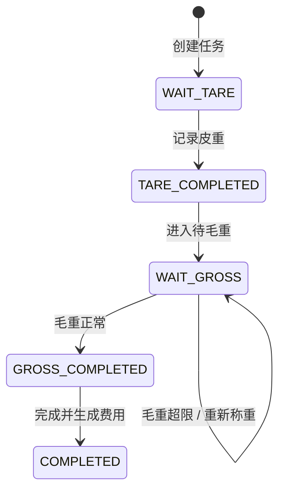

# TimberOps 业务流程

## 1. 当前业务范围

系统当前管理车辆、客户、出厂方向人工称重、完成后的基础计费及经营查询。货物分类为矿石 `ORE`、煤炭 `COAL`、木材 `TIMBER` 和其他 `OTHER`；客户可选，订单、库存和物料主数据尚未实现。

重量统一以吨保存，数据库精度为三位小数；金额使用人民币和两位小数。业务计算使用 `Decimal`，不使用 float。

## 2. 标准称重闭环



正式生命周期状态是：

- `WAIT_TARE`
- `TARE_COMPLETED`
- `WAIT_GROSS`
- `GROSS_COMPLETED`
- `COMPLETED`
- `CANCELLED`（领域模型保留的终止状态）

`LOADING` 已从正式状态机移除。`POST .../loading` 仅是旧客户端兼容入口，其行为等价于进入 `WAIT_GROSS`。

### 创建任务

操作员选择未删除车辆、货物分类和可选客户。系统将当前司机信息和车辆核定总质量写入任务快照，并生成唯一任务号。任务初始为 `WAIT_TARE`、`weight_result=PENDING`。

### 记录皮重

只有 `WAIT_TARE` 可以提交皮重。系统追加 `TARE` 类型的 `WeighingRecord`，更新任务皮重与时间，进入 `TARE_COMPLETED`。

### 等待毛重

从 `TARE_COMPLETED` 显式转为 `WAIT_GROSS`。该步骤表示车辆完成装载并等待第二次过磅。

### 毛重、净重与超重

只有 `WAIT_GROSS` 可以首次提交毛重：

```text
net_weight = gross_weight - tare_weight
overweight = max(gross_weight - allowed_gross_weight, 0)
```

- 正常：`weight_result=NORMAL`，任务进入 `GROSS_COMPLETED`
- 超重：`weight_result=OVERWEIGHT`，任务保持 `WAIT_GROSS`

`weight_result` 是重量判定，`status` 是任务生命周期，两者不是同一个状态字段。

### 超重复磅

仅当任务处于 `WAIT_GROSS` 且上次结果为 `OVERWEIGHT` 时允许 `REWEIGH`，并要求填写备注。每次读数都追加到 `WeighingRecord`，任务上的毛重、净重和超重值更新为最近有效结果；正常后才进入 `GROSS_COMPLETED`。

### 完成与计费

仅 `GROSS_COMPLETED + NORMAL` 可以完成。完成事务中：

1. 状态更新为 `COMPLETED`；
2. 按车辆类型和完成时间选择生效的 BillingRule；
3. 为任务生成唯一 BillingRecord，初始为 `UNPAID`；
4. 写入 AuditLog；
5. 事务提交成功后增加运行时指标。

超重任务不能完成，也不会提前产生费用。

## 3. 车辆、客户与任务生命周期

- 车辆和客户使用 `deleted_at` 软删除。
- 存在任何称重历史的车辆或客户禁止删除，避免破坏追溯关系。
- 任务只有 `WAIT_TARE`、`TARE_COMPLETED`、`WAIT_GROSS` 可软删除，且必须提供原因。
- `COMPLETED`、`CANCELLED` 等终态任务不能通过删除接口删除。
- 列表和经营统计默认排除软删除数据，历史关联仍保留。

## 4. 费用流程

费用记录是任务完成时的快照，不因后续 BillingRule 调整而改变。状态为：

- `UNPAID`：待支付
- `PAID`：已支付；重复支付请求幂等
- `WAIVED`：已免除，仅 ADMIN 可执行，不计入收入

当前没有支付网关；`pay` 是业务确认动作，不代表外部资金渠道结算。

## 5. 身份、授权与审计

- 首个 ADMIN 由 CLI 初始化；公开注册用户默认无角色。
- ADMIN 管理角色；OPERATOR 执行日常称重；VIEWER 只读。
- 后端 permission 是最终安全边界，操作人从 JWT 解析，客户端不能提交 operator id。
- 删除、称重完成、费用支付/免除和角色变更等敏感动作写入追加式 AuditLog。
- Audit 查询展示可读业务对象名称，同时保留稳定的 target type 和 UUID。

## 6. Dashboard 与报表

Dashboard、日报和月报按 UTC+8 确定日期边界。只有 `COMPLETED` 任务计入完成净重，`WAIVED` 费用不计收入。报表与历史导出生成 `.xlsx`，不会修改业务数据。

## 7. AI 与 MCP 边界

应用内 AI Agent 和外部 MCP Server 仅调用 AnalyticsService 查询数据。它们不能创建或改变称重、费用、用户和审计记录，且不可用时不得阻塞核心业务。
