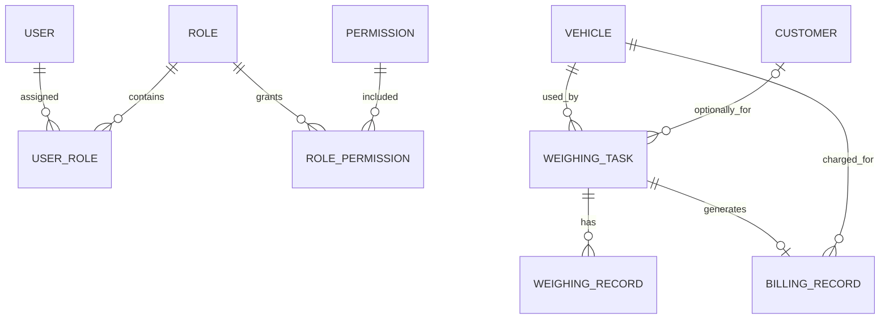

# TimberOps 数据库设计

## 1. 设计原则

- PostgreSQL 是业务数据源，ORM 使用 SQLAlchemy 2，结构只通过 Alembic migration 演进。
- 业务主键为 UUID；时间字段使用带时区 datetime；重量 `NUMERIC(10,3)`，金额 `NUMERIC(10,2)`。
- `WeighingRecord` 和 `AuditLog` 作为追加式历史使用，不提供更新/删除业务接口。
- 车辆、客户、称重任务通过 `deleted_at` 软删除，查询显式排除已删除记录。
- 当前数据库没有 Order、OrderItem、Inventory、InventoryTransaction 或 Material 表。

## 2. 实体关系



`AuditLog.operator_id`、`target_id` 以及部分历史操作人字段是可空 UUID 引用，不建立数据库外键，以便账号或业务对象生命周期变化后仍保留审计事实。

## 3. 已实现表

### users

`id`、唯一 `username`、`password_hash`、`real_name`、`is_active`、`created_at`、`updated_at`。绝不保存或返回明文密码。

### roles / permissions

- `roles`：唯一名称、描述、时间戳
- `permissions`：唯一 code、名称、描述、创建时间
- `user_roles`：用户与角色唯一组合
- `role_permissions`：角色与权限唯一组合

标准角色和权限由 migration / RBAC Catalog 初始化。

### vehicles

`plate_number` 唯一；保存司机信息、标准车辆类型 `SMALL/MEDIUM/LARGE`、兼容旧值的 `vehicle_type_legacy`、核定总质量、备注和 `deleted_at`。

### customers

保存名称、联系人、电话、备注、时间戳和 `deleted_at`。称重任务对客户是可选关联。

### weighing_tasks

保存任务号、车辆/客户关联、方向、货物分类与名称、司机快照、皮重/毛重/净重/超重、核定总质量快照、`status`、独立 `weight_result`、各阶段时间、创建人、并发 `version` 和软删除信息。

关键约束包括：正重量、毛重大于皮重、超重非负、任务号唯一。正式状态枚举不含 `LOADING`。

### weighing_records

每次接受的读数包含任务、`TARE/GROSS/REWEIGH`、重量、任务内序号、记录时间、操作人、`MANUAL/DEVICE` 来源和备注。`(weighing_task_id, sequence_no)` 唯一；当前业务只产生手工来源，DEVICE 为扩展枚举。

### billing_rules

按车辆类型保存费用、CNY 币种、生效时间和创建时间；`(vehicle_type, effective_time)` 唯一，可保留历史费率。

### billing_records

保存唯一 `weighing_task_id`、车辆、车辆类型快照、金额、`UNPAID/PAID/WAIVED` 与创建时间。一任务最多一条费用记录。

### audit_logs

保存 `operator_id`、action、target type/id、前后 JSON 快照、原因和创建时间。API 查询时由 AuditService 批量解析 `target_display`；展示解析失败回退为 target id，不改变审计表结构。

## 4. 状态与数据规则

### WeighingTask.status

`WAIT_TARE`、`TARE_COMPLETED`、`WAIT_GROSS`、`GROSS_COMPLETED`、`COMPLETED`、`CANCELLED`。

### WeighingTask.weight_result

`PENDING`、`NORMAL`、`OVERWEIGHT`。这是重量判定，不替代生命周期状态。

### 其他枚举

- CargoType：`ORE`、`COAL`、`TIMBER`、`OTHER`
- VehicleType：`SMALL`、`MEDIUM`、`LARGE`
- PaymentStatus：`UNPAID`、`PAID`、`WAIVED`
- WeighingDirection：当前业务使用 `OUTBOUND`；枚举同时保留 `INBOUND`

## 5. 软删除与引用

- 车辆/客户有称重历史时 Service 拒绝删除。
- 可删除状态的称重任务记录 `deleted_at`、`deleted_by` 和必填原因。
- 外键使用 `RESTRICT` 或关联表 `CASCADE`，具体以 ORM 和 migration 为准；Service 规则是更严格的业务边界。

## 6. Migration 基线

`backend/migrations/versions/` 当前按新增 revision 演进，包括称重核心、流程简化、生命周期与计费、User、RBAC、操作人、Dashboard/Billing/Audit/Report 权限。禁止编辑已提交历史 migration；执行：

```powershell
cd backend
python -m alembic upgrade head
python -m alembic check
```
