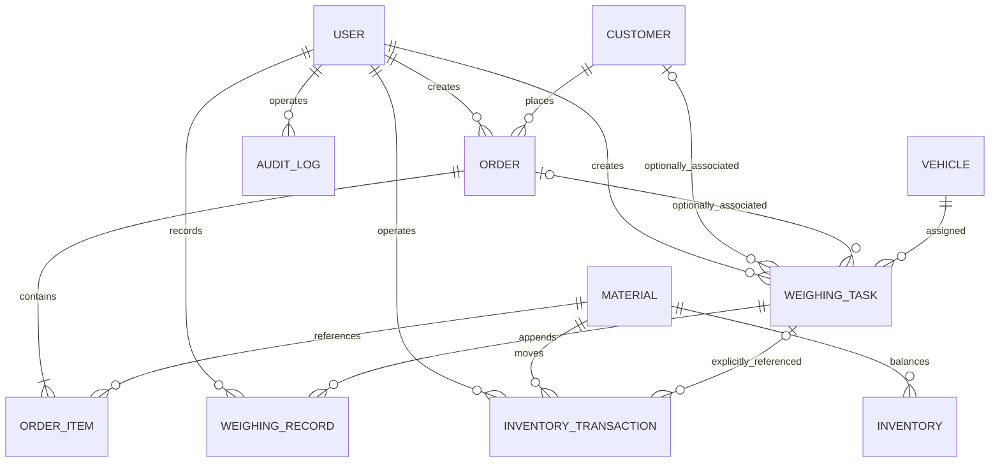

# TimberOps 数据库与 ER 设计

## 1. 设计约定

- PostgreSQL 为唯一事实源，主键建议使用 UUID。
- 核心称重字段以吨为单位，命名使用 `_tons` 后缀，类型为 `NUMERIC(10, 3)`；应用层对应 Python `Decimal`，禁止使用 float。
- `0.001 t = 1 kg`。未来设备返回 kg 时，由 `WeighbridgeAdapter` 转为吨后再进入领域层。
- 金额使用 `NUMERIC(14, 2)`；非称重业务数量按各自单位使用 `NUMERIC(14, 3)`。
- 时间使用 `TIMESTAMPTZ` 并以 UTC 保存。
- 业务编号设置唯一约束；枚举由应用和数据库约束共同保护。
- 已保存的称重记录与审计记录只追加，不原地覆盖。
- 所有数据库结构变更通过 Alembic 管理。

领域实体与物理表映射：

| 领域实体 | PostgreSQL 表 |
| --- | --- |
| User | `users` |
| Customer | `customers` |
| Vehicle | `vehicles` |
| Material | `materials` |
| Inventory | `inventory` |
| InventoryTransaction | `inventory_transactions` |
| Order | `orders` |
| OrderItem | `order_items` |
| WeighingTask | `weighing_tasks` |
| WeighingRecord | `weighing_records` |
| AuditLog | `audit_logs` |

## 2. ER 关系

称重任务可完全独立存在。`vehicle_id` 必填；`customer_id` 和 `order_id` 可空。订单与称重为可选的一对多关系。称重净重不会自动生成订单履约或库存流水；`inventory_transactions.weighing_task_id` 只用于显式业务处理后的追溯关联。

## 3. 核心表

### users

| 字段 | 类型 | 约束/说明 |
| --- | --- | --- |
| id | UUID | PK |
| username | VARCHAR(64) | UNIQUE, NOT NULL |
| password_hash | VARCHAR(255) | NOT NULL，仅保存强哈希 |
| display_name | VARCHAR(100) | NOT NULL |
| role | VARCHAR(32) | NOT NULL |
| is_active | BOOLEAN | NOT NULL, default true |
| last_login_at | TIMESTAMPTZ | nullable |
| created_at / updated_at | TIMESTAMPTZ | NOT NULL |

### customers

| 字段 | 类型 | 约束/说明 |
| --- | --- | --- |
| id | UUID | PK |
| customer_code | VARCHAR(32) | UNIQUE, NOT NULL |
| name | VARCHAR(200) | NOT NULL |
| contact_name | VARCHAR(100) | nullable |
| contact_phone | VARCHAR(32) | nullable |
| address | TEXT | nullable |
| is_active | BOOLEAN | NOT NULL |
| created_at / updated_at | TIMESTAMPTZ | NOT NULL |

### vehicles

| 字段 | 类型 | 约束/说明 |
| --- | --- | --- |
| id | UUID | PK |
| plate_number | VARCHAR(20) | UNIQUE, NOT NULL，标准化后保存 |
| driver_name | VARCHAR(100) | nullable，常用司机默认值 |
| driver_phone | VARCHAR(32) | nullable |
| vehicle_type | VARCHAR(50) | NOT NULL |
| allowed_gross_weight_tons | NUMERIC(10,3) | NOT NULL, `> 0`，车辆允许最大总质量 |
| remark | TEXT | nullable |
| created_at / updated_at | TIMESTAMPTZ | NOT NULL |

限重来自车辆档案或依法维护的业务配置，禁止在称重代码中硬编码固定值。车辆司机可能按趟次变化，因此任务还保存当次司机快照。

### materials

`materials` 仅用于企业内部订单和库存，不作为独立称重的必填主数据。

| 字段 | 类型 | 约束/说明 |
| --- | --- | --- |
| id | UUID | PK |
| material_code | VARCHAR(32) | UNIQUE, NOT NULL |
| name | VARCHAR(120) | NOT NULL |
| category | VARCHAR(64) | nullable |
| specification | VARCHAR(200) | nullable |
| unit | VARCHAR(16) | NOT NULL，由内部业务定义 |
| is_active | BOOLEAN | NOT NULL |
| created_at / updated_at | TIMESTAMPTZ | NOT NULL |

### inventory

| 字段 | 类型 | 约束/说明 |
| --- | --- | --- |
| id | UUID | PK |
| material_id | UUID | FK materials, NOT NULL |
| warehouse_code | VARCHAR(32) | NOT NULL |
| quantity | NUMERIC(14,3) | NOT NULL, default 0，单位取自 Material |
| version | INTEGER | NOT NULL，乐观锁 |
| created_at / updated_at | TIMESTAMPTZ | NOT NULL |

唯一约束：`(material_id, warehouse_code)`。库存数量不因称重任务完成而自动变化。

### inventory_transactions

| 字段 | 类型 | 约束/说明 |
| --- | --- | --- |
| id | UUID | PK |
| transaction_no | VARCHAR(40) | UNIQUE, NOT NULL |
| material_id | UUID | FK materials, NOT NULL |
| warehouse_code | VARCHAR(32) | NOT NULL |
| transaction_type | VARCHAR(32) | INBOUND / OUTBOUND / ADJUSTMENT / REVERSAL |
| quantity | NUMERIC(14,3) | NOT NULL, `> 0` |
| direction | SMALLINT | NOT NULL，`1` 入、`-1` 出 |
| weighing_task_id | UUID | nullable FK weighing_tasks，仅显式关联 |
| order_id | UUID | nullable FK orders |
| reversal_of_id | UUID | nullable FK 本表 |
| occurred_at | TIMESTAMPTZ | NOT NULL |
| operated_by | UUID | FK users, NOT NULL |
| remark | TEXT | nullable |
| created_at | TIMESTAMPTZ | NOT NULL；流水不可覆盖 |

### orders

| 字段 | 类型 | 约束/说明 |
| --- | --- | --- |
| id | UUID | PK |
| order_no | VARCHAR(40) | UNIQUE, NOT NULL |
| customer_id | UUID | FK customers, NOT NULL |
| order_type | VARCHAR(16) | PURCHASE / SALES |
| status | VARCHAR(32) | DRAFT / CONFIRMED / PARTIAL / FULFILLED / CANCELLED |
| expected_date | DATE | nullable |
| notes | TEXT | nullable |
| created_by | UUID | FK users, NOT NULL |
| created_at / updated_at | TIMESTAMPTZ | NOT NULL |

### order_items

| 字段 | 类型 | 约束/说明 |
| --- | --- | --- |
| id | UUID | PK |
| order_id | UUID | FK orders, NOT NULL |
| material_id | UUID | FK materials, NOT NULL |
| planned_quantity | NUMERIC(14,3) | NOT NULL, `> 0` |
| fulfilled_quantity | NUMERIC(14,3) | NOT NULL, default 0 |
| unit_price | NUMERIC(14,2) | nullable |
| created_at / updated_at | TIMESTAMPTZ | NOT NULL |

### weighing_tasks

| 字段 | 类型 | 约束/说明 |
| --- | --- | --- |
| id | UUID | PK |
| task_no | VARCHAR(40) | UNIQUE, NOT NULL |
| vehicle_id | UUID | FK vehicles, NOT NULL |
| customer_id | UUID | nullable FK customers |
| order_id | UUID | nullable FK orders |
| weighing_direction | VARCHAR(16) | NOT NULL, V1 default OUTBOUND；预留 INBOUND |
| cargo_type | VARCHAR(16) | NOT NULL：ORE / COAL / TIMBER / OTHER |
| cargo_name | VARCHAR(100) | nullable；OTHER 时建议必填 |
| cargo_remark | TEXT | nullable |
| driver_name_snapshot | VARCHAR(100) | nullable，当次司机快照 |
| driver_phone_snapshot | VARCHAR(32) | nullable |
| tare_weight_tons | NUMERIC(10,3) | nullable, `> 0` |
| gross_weight_tons | NUMERIC(10,3) | nullable, `> 0`；最新有效重车/复磅值 |
| net_weight_tons | NUMERIC(10,3) | nullable, `> 0`；服务端计算 |
| allowed_gross_weight_tons | NUMERIC(10,3) | NOT NULL, `> 0`；车辆核定值快照 |
| overweight_tons | NUMERIC(10,3) | NOT NULL, default 0，`>= 0` |
| status | VARCHAR(32) | NOT NULL，纯流程状态 |
| weight_result | VARCHAR(16) | NOT NULL：PENDING / NORMAL / OVERWEIGHT |
| tare_time | TIMESTAMPTZ | nullable |
| gross_time | TIMESTAMPTZ | nullable；最新有效重车/复磅时间 |
| completed_at | TIMESTAMPTZ | nullable |
| version | INTEGER | NOT NULL，防并发覆盖 |
| created_by | UUID | FK users, NOT NULL |
| created_at / updated_at | TIMESTAMPTZ | NOT NULL |

状态只允许：`WAIT_TARE / TARE_COMPLETED / LOADING / WAIT_GROSS / GROSS_COMPLETED / COMPLETED / CANCELLED`。`NORMAL` 和 `OVERWEIGHT` 只能出现在 `weight_result`。

创建任务时必须复制车辆当前 `allowed_gross_weight_tons`。如果 `order_id` 非空，必须校验订单存在且可关联；当 `customer_id` 与订单同时存在时，两者必须一致。无订单任务不需要补填 Material，也可以完成并生成磅单。

数据库检查约束至少覆盖：重量非负、`gross_weight_tons > tare_weight_tons`（两者均存在时）、超重值非负。状态组合、最新记录匹配和跨表规则由应用服务执行并测试。

### weighing_records

| 字段 | 类型 | 约束/说明 |
| --- | --- | --- |
| id | UUID | PK |
| weighing_task_id | UUID | FK weighing_tasks, NOT NULL |
| weight_type | VARCHAR(16) | NOT NULL：TARE / GROSS / REWEIGH |
| weight_tons | NUMERIC(10,3) | NOT NULL, `> 0` |
| sequence_no | INTEGER | NOT NULL，任务内严格递增 |
| recorded_at | TIMESTAMPTZ | NOT NULL |
| recorded_by | UUID | FK users, NOT NULL |
| source | VARCHAR(16) | NOT NULL：MANUAL / DEVICE；V1 仅 MANUAL |
| remark | TEXT | nullable，复磅/人工更正可要求填写 |
| created_at | TIMESTAMPTZ | NOT NULL |

唯一约束：`(weighing_task_id, sequence_no)`。所有实际读数先写入本表；禁止更新或删除旧读数。首次空车为 `TARE`，首次重车为 `GROSS`，超重后的每次重称为 `REWEIGH`。任务汇总字段取最新有效读数，但完整历史始终由本表还原。

### audit_logs

| 字段 | 类型 | 约束/说明 |
| --- | --- | --- |
| id | UUID | PK |
| operator_id | UUID | nullable FK users；系统动作可为空 |
| action | VARCHAR(64) | NOT NULL |
| target_type | VARCHAR(64) | NOT NULL |
| target_id | UUID | nullable |
| before_value | JSONB | nullable，保存前需脱敏 |
| after_value | JSONB | nullable，保存前需脱敏 |
| reason | TEXT | 人工更改或纠错时必填 |
| request_id | VARCHAR(64) | nullable，链路追踪/幂等关联 |
| created_at | TIMESTAMPTZ | NOT NULL |

审计日志只追加，并为 `(target_type, target_id)`、`operator_id`、`created_at` 建索引。

## 4. 状态组合约束

| status | 允许的 weight_result | 说明 |
| --- | --- | --- |
| WAIT_TARE / TARE_COMPLETED / LOADING | PENDING | 尚未产生重车判定 |
| WAIT_GROSS | PENDING 或 OVERWEIGHT | 首次待称为 PENDING；超重卸货待复磅可保留最近结果 |
| GROSS_COMPLETED | NORMAL 或 OVERWEIGHT | 已提交一次重车或复磅读数 |
| COMPLETED | NORMAL | V1 禁止超重完成 |
| CANCELLED | PENDING / NORMAL / OVERWEIGHT | 取消不篡改已有判定 |

该表由应用层状态机强制执行，并可用数据库 `CHECK` 约束补强。任务完成条件至少包括 `status=GROSS_COMPLETED`、`weight_result=NORMAL` 以及有效皮重、毛重、净重均存在。

## 5. 索引与事务

- 常用索引：任务 `(status, created_at)`、`(cargo_type, completed_at)`、`(vehicle_id, created_at)`、`(weight_result, gross_time)`。
- 所有外键建立索引；任务号、订单号、车牌号使用唯一索引。
- 车牌号去空格并统一大写后保存。
- 一次提交读数必须原子完成：锁定任务、插入 `weighing_records`、更新任务汇总与状态、写入 `audit_logs`。
- 完成磅单不自动触发订单或库存事务。未来显式关联用例必须有独立幂等键和审计记录。
- 更正通过新增纠错事实或冲正流水表达，不级联删除历史业务数据。
